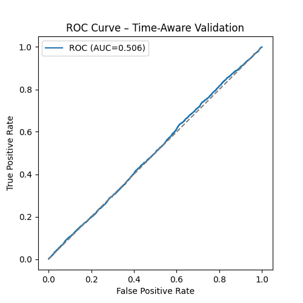
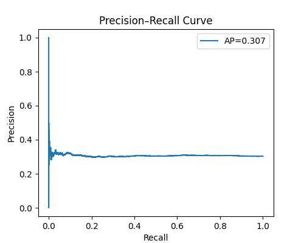
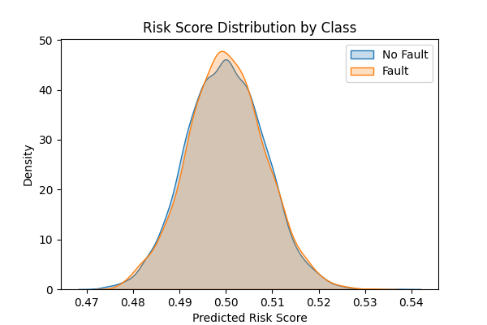

# IoT Equipment Fault Risk Modeling – Lessons Learned

## Dataset Used (Initial Attempt)
**IoT-Based Equipment Fault Prediction Dataset (Kaggle)**  
https://www.kaggle.com/datasets/programmer3/iot-based-equipment-fault-prediction-dataset

This dataset contains chronologically ordered sensor readings such as temperature, vibration, pressure, voltage, and current, along with FFT features, normalized values, an anomaly score, and fault labels.

---

## Project Goal
The goal of this project was to build a **risk model** that can answer:

- Is a fault likely to happen soon?
- Can we detect risk **before** the fault actually occurs?

Later, the plan was to extend this to identify **which fault type** is likely, but only after reliable early-risk detection.

---

## Modeling Approach
- Treated row order as time (dataset is chronologically ordered)
- Used time-aware train/test split (no shuffling)
- Built a logistic regression model for **fault vs no-fault risk**
- Evaluated using ROC curve, Precision–Recall curve, and risk score distributions

This setup avoids time leakage and gives an honest evaluation.

---

## Results (Why the Dataset Failed)

### 1. ROC Curve (AUC ≈ 0.50)
The ROC curve is almost a straight diagonal line.

This means:
- The model performs close to random guessing
- There is no useful ranking between fault and no-fault samples

---

### 2. Precision–Recall Curve (AP ≈ 0.30)
Precision drops immediately and stays flat across recall values.

This shows:
- No meaningful early-warning capability
- The model mostly predicts at the base fault rate

---

### 3. Risk Score Distribution Overlap
The predicted risk score distributions for:
- Fault
- No Fault

almost completely overlap around 0.5.

This means:
- The model cannot separate risky and normal behavior
- Features do not contain early discriminative signal

---

## Root Cause Analysis
The failure is not due to the model, but due to **dataset structure**:

- Time information is implicit but strong
- FFT features, normalized values, and anomaly score are already derived using past data
- `Anomaly_Score` rises very close to or during faults, not before
- Fault labels act as event markers, not early indicators

When evaluated correctly with time-aware validation, the dataset does **not support early fault risk prediction**.

---

## Key Takeaway
This dataset looks suitable for fault prediction, but it is **not suitable for early warning modeling**.

Respecting time order removes data leakage and exposes the real limitation:
there is almost no early predictive signal available.

Understanding why a dataset fails is more valuable than forcing good metrics.

---

