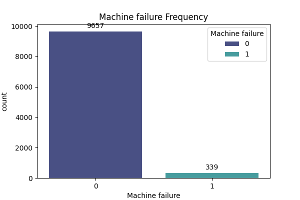
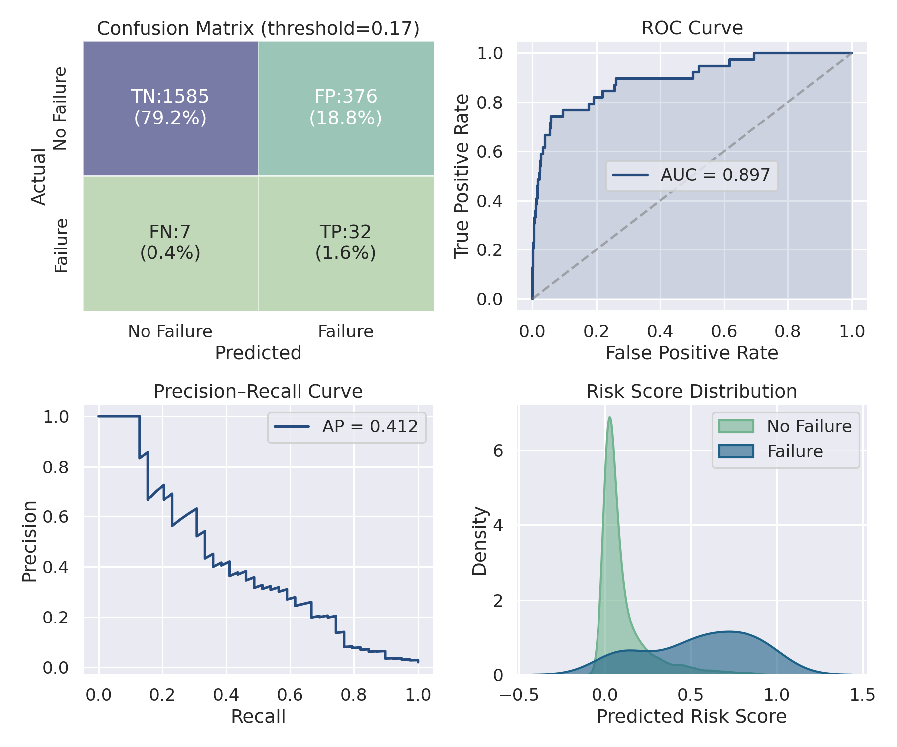

# Machine Failure Predictor

A real-time machine failure prediction system using logistic regression with rolling window features. The idea is to monitor sensor data and catch failures before they actually happen. Instead of just looking at one row of data, I have given the model "memory" using rolling windows.

## System Architecture

### Primary Risk Model
The main scorer. It checks the sensor values and outputs a probability of impending failure. This is the core of the system—everything else depends on its output.

### Diagnostic Specialists
Once the risk crosses a threshold, these four models identify exactly what is going wrong:
- **TWF** – Tool Wear Failure
- **HDF** – Heat Dissipation Failure
- **PWF** – Power Failure
- **OSF** – Overstrain Failure

No need to label everything as a generic "failure." We know the specific mode.

### Diagnostic Model Performance

| Model | ROC-AUC | Precision | Recall | FPR |
|-------|---------|-----------|--------|-----|
| TWF   | 0.979   | 1.000     | 0.556  | 0.000 |
| HDF   | 0.996   | 1.000     | 0.522  | 0.000 |
| PWF   | 0.967   | 1.000     | 0.526  | 0.000 |
| OSF   | 0.996   | 1.000     | 0.500  | 0.000 |

All four models achieve **perfect precision** (zero false positives) on the test set, meaning when they flag a specific failure mode, it is correct. The conservative recall values (50-56%) are intentional—these models only trigger when the Primary Risk Model already indicates high risk.

## Feature Engineering

Raw data is processed into 5-step rolling windows to capture machine physics:

| Feature | Purpose |
|---------|---------|
| Rolling_Mean | Baseline stability |
| Volatility | Signal noise and vibration |
| Delta | Instantaneous change |
| Rolling_Delta | Acceleration of sensor values toward failure |

**Rolling_Delta is the most important feature.** It tracks whether the machine is failing faster and faster—if the sensor values are accelerating away from normal, the model catches it.

The model uses five core sensor inputs:
- Air temperature [K]
- Process temperature [K]
- Rotational speed [rpm]
- Torque [Nm]
- Tool wear [min]

## The Problem

Machine failures do not happen often. Most of the time, machines run fine. This means the dataset has very few failure examples compared to normal ones. If you just try to maximize accuracy, you end up predicting "no failure" almost always—which is useless.

The dataset has **9,661 normal runs** but only **339 failures**—roughly a 28:1 ratio. If you just predict "no failure" every time, you get 96.6% accuracy but catch zero failures.



## Current Performance

| Metric | Result |
|--------|--------|
| Primary Model ROC-AUC | 0.901 |
| Lead Time | 2-step advance warning before failure |
| State Flow | HEALTHY → WARNING → CRITICAL |
| Dashboards | All plots in `/images` |

The model filters start-up noise and transitions cleanly through the risk states.

## Threshold Experiments

I ran experiments at different decision thresholds. The ROC-AUC stayed at 0.897 across all runs. This makes sense because ROC-AUC is about ranking, not where you cut the line.

What changes is the recall and the false positive rate:

| Threshold | Recall | False Positive Rate | TP | FP | FN | TN |
|-----------|--------|---------------------|----|----|----|-----|
| 0.416     | 0.718  | 0.055               | 28 | 108| 11 | 1853|
| 0.299     | 0.769  | 0.094               | 30 | 184| 9  | 1777|
| 0.165     | 0.821  | 0.192               | 32 | 376| 7  | 1585|
| 0.116     | 0.872  | 0.258               | 34 | 505| 5  | 1456|

The threshold works like a **risk sensitivity slider**:
- Higher threshold (0.416) → fewer false alarms, but many failures missed.
- Lower threshold (0.116) → most failures caught, but many false alerts.

### Cost Framing

You can think of this as a cost problem:

```
Total Cost = (FN × Cost_A) + (FP × Cost_B)
```

- FN = missed failures (false negatives)
- FP = false alarms (false positives)
- Cost_A = what you lose when you miss a real failure (downtime, damage)
- Cost_B = what you lose on a false alarm (unnecessary inspection, wasted time)

There is no single "best" threshold. It depends on the actual costs in your situation.

## Dashboard

The dashboard combines four key plots to help understand the model and choose a threshold:



### What Each Plot Shows

**1. Confusion Matrix (top left)**  
At threshold 0.12, the model catches 34 out of 39 failures (TP=34, FN=5) but also flags 505 normal runs as risky (FP=505). This is the low-threshold scenario where recall is high but false alarms are many.

**2. ROC Curve (top right)**  
The **ROC-AUC is 0.897**. This tells you how well the model separates failures from normal runs. The score stays the same no matter what threshold you pick—you are just moving along the same curve.

**3. Precision-Recall Curve (bottom left)**  
Shows the trade-off between precision and recall. The **average precision is 0.412**. When you increase recall (catch more failures), precision drops (more false alarms). This plot is usually more useful than ROC when one class is rare.

**4. Risk Score Distribution (bottom right)**  
Shows how predicted risk scores are spread out. **Failures (blue) tend to cluster at higher scores**, while normal runs (green) are mostly near zero. But there is overlap, which is why the threshold matters.

## Logs

Each run writes a log file under `logs/`. The log includes the threshold used, data split, parameters, and evaluation metrics. The plots correspond to the most recent logged run.


---