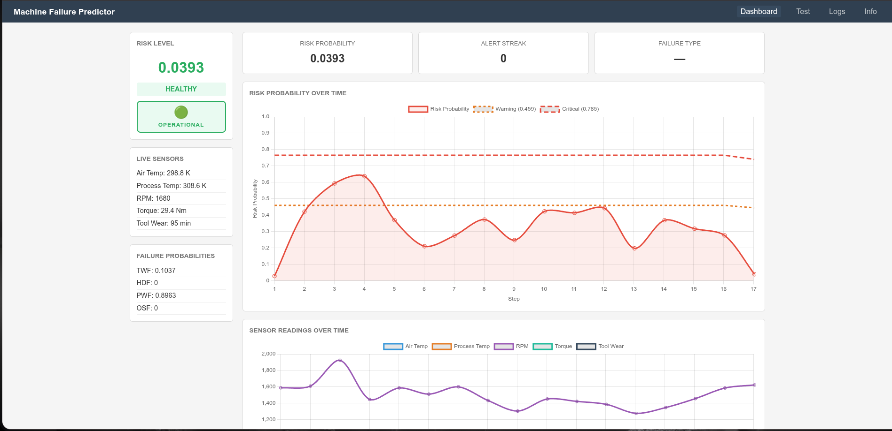
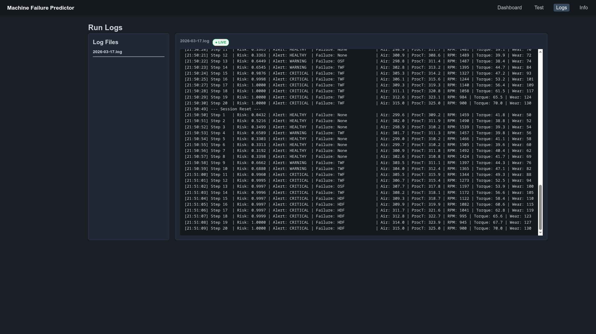
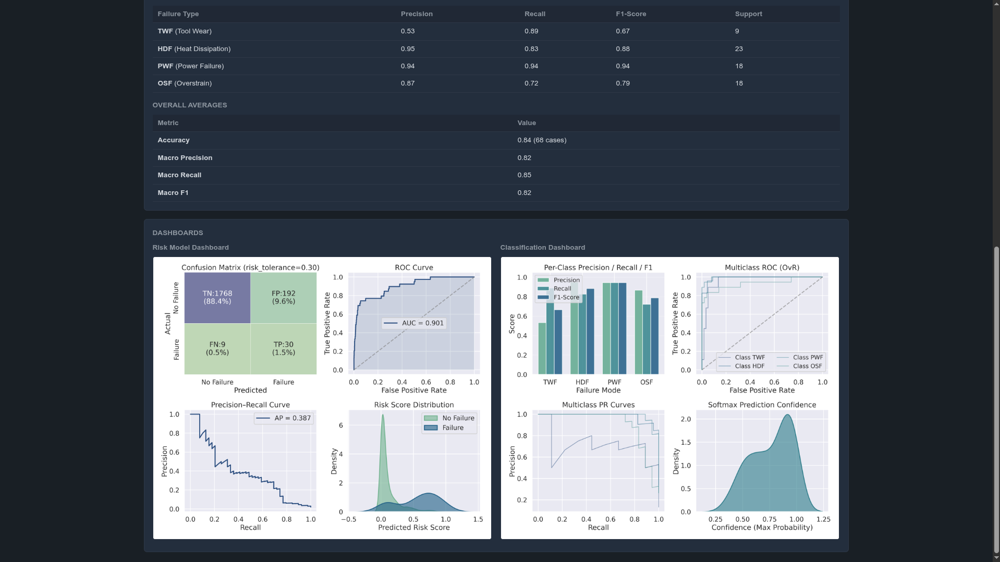
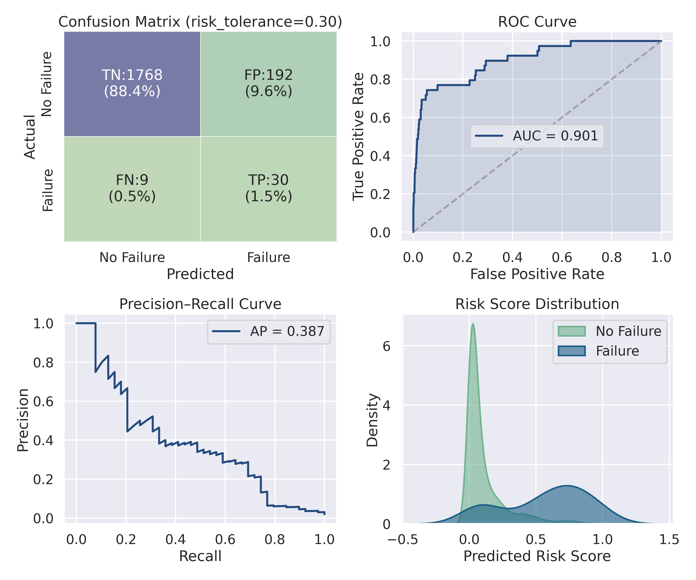
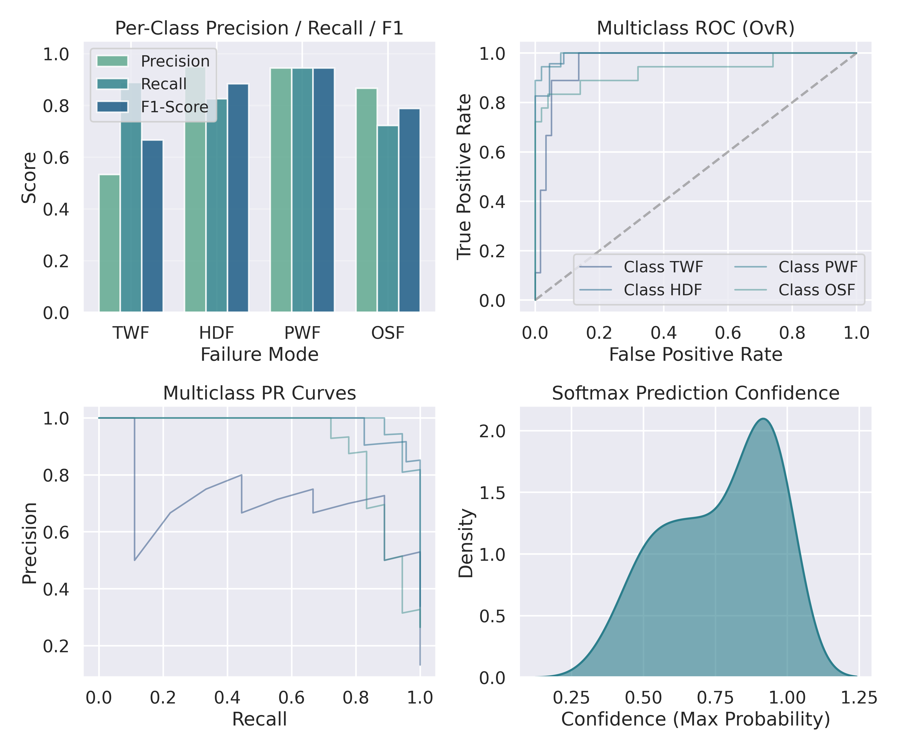

# Machine Failure Predictor

This is my Machine Failure Prediction project. I built this because saving lives and money in a factory setting is actually a big deal. If a machine fails without warning, it's not just expensive repair, it's dangerous for the workers.

Basically, I want to catch the failure *before* it happens using sensor data.

---

## Moving to MySQL

Instead of just loading a CSV file, I moved the whole project to a **MySQL** backend.
*   **Stability**: It handles the data much better than a flat file.
*   **Testing**: I made a script `create_test_tables.py` to split data into specific failure modes (Heat, Tool Wear, etc.) so I can verify if the model actually knows what is happening.
* **Scalability**: It handles the data much better than a flat file.

---

# Part 1: Feature Engineering & Insights

Machine failures aren't instant; they follow a trend. If you only look at one row, you miss the history. I created four main features to catch these trends:

1.  **Rolling Mean**: Smoothing the sensor noise.
2.  **Volatility (Std Dev)**: Primary indicator of risk.
3.  **Delta**: Absolute change between current and previous values.
4.  **Rolling Delta**: Measuring the average change over a window.

### The "Needle in a Haystack" Problem
I realized during the study that **Accuracy is a lie**. In the dataset, 97% of the time the machine is fine. If a model just guesses "Healthy" every time, it gets 97% accuracy but it's useless. I focused on **ROC-AUC** and **Precision-Recall** to make sure the model finds the rare failures without crying wolf.

### My Personal Study & Insights
1.  **Safety Net Logic**: I built the Tier 1 model as a "safety net." Its only job is to catch random errors that the specialized models might miss.
2.  **Trend > Instant**: The "Delta" features are much more important than the raw sensor values. A high temperature is fine, but a *rapidly rising* temperature is a breakdown starting.
3.  **Sensitivity Trade-off**: I realized there is a massive gap between "High Sensitivity" (catching every failure but having false alarms) and "Low Sensitivity" (only alerting when sure). I designed a slider to let the user choose the cost/safety balance.

---

# Part 2: The Hurdle Model

For the modeling part, I used a **Hurdle Model** architecture. The data has to clear two separate hurdles:

- **Hurdle 1: The Global Risk Scorer** (Safety Net). It catches everything, including random glitches.
- **Hurdle 2: The Diagnostic specialist**. Only if Hurdle 1 is cleared, this model identifies if it is Heat (HDF), Tool Wear (TWF), etc.

---

## Project Showcase

<details>
  <summary><b>Click to see the System UI & Dashboards</b></summary>
  
  ### 1. Live Monitoring Dashboard
  
  
  ### 2. Real-time Log Engine
  
  
  ### 3. Deep Performance Metrics
  
  
  ### 4. Global Risk Analysis (Tier 1)
  
  
  ### 5. Diagnostic Specialization (Tier 2)
  
</details>

---

# How to Run If you want to

### Prerequisites
- **Python 3.14** (or compatible 3.x version)
- **MySQL Server**

### Setup Instructions

1. **Clone the repo:**
   ```bash
   git clone https://github.com/Sarrveshwer/Risk-eval-using-Logistic-Regression
   cd Risk-eval-using-Logistic-Regression
   ```

2. **Set up MySQL Server:**
   - Install MySQL Server on your machine and ensure it is running locally.
   - Set the root user password to `root` during installation (or update your credentials in the scripts such as `ml_engine.py`).
   - Open your MySQL Command Line Client and create the project's database:
     ```sql
     CREATE DATABASE ml_model;
     ```
   - *Note: You must ensure that your local MySQL server is running before attempting to start the dashboard.*

3. **Install Requirements:**
   Run the requirements script to set up your environment:
   ```bash
   python requirements.py
   ```

4. **Run the Dashboard:**
   After ensuring MySQL is running locally, start the Django development server:
   ```bash
   python dashboard/manage.py runserver
   ```

5. **Open the below url in your Webbrowser: **
```
http://127.0.0.1:8000/
```
Now login and use the app
