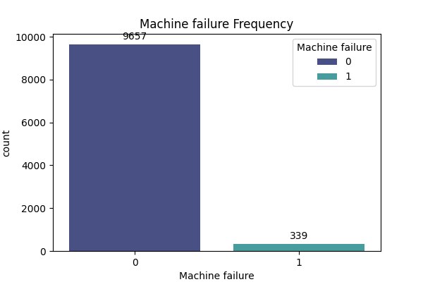

# Machine Failure Predictor

## Why I built this

The main reason I built this is simple: it saves both lives and money.

In a real factory, machine breaking down is not only expensive, but it's also dangerous. If a machine fails suddenly, it can hurt the people working near it. I wanted to see if I could use sensor data (like temperature and torque) to catch failures *before* they actually happen.

## MySQL 

Instead of just loading a single CSV file, I moved the whole project to a **MySQL** backend.
*   It's much more stable than a flat file.
*   I can handle thousands of rows easily.
*   I made a script called `create_test_tables.py` that automatically splits the data into specific failure modes (Heat, Tool Wear, etc.). This made it way easier to test if the model actually knows the difference between a hot motor and a worn-out tool.

## Hurdle Model Architecture

I realized one model trying to do everything was a mess. So I built this as a Hurdle Model. 

Instead of asking one model to find the failure and name it at the same time, the data has to clear two separate "hurdles":

**Hurdle 1: The Probability Gate (Binary Logistic Regression)**
    This is the first hurdle. The model only looks for a general "Risk Score" (0 to 1). If the sensors don't look risky enough to "clear the hurdle," nothing else happens. This keeps the system fast and prevents fake diagnoses.

**Hurdle 2: The Diagnosis (Multinomial Softmax)**
    If (and only if) the first hurdle is cleared, this second model wakes up. Its job is to pinpoint exactly why the machine is struggling—is it **HDF** (Heat), **TWF** (Tool Wear), or just a random glitch? 

## Adding Features

Machine failures aren't usually instant; they're a process. If you only look at one row of data, you miss the trend.

I created four types of features:

**1) The Rolling Mean** is a smoothing technique used to identify the underlying trend 
        of a dataset by filtering noise.

**2) Volatility(Rolling Standard deviation)** measures the dispersion of data points around 
        the mean over a specific window. In predictive modeling, it is the primary indicator of
        risk or instability.
    
**3) Delta** represents the absolute change between the current value and a previous value. 
        It shifts the focus from the "level" of the data to the "change" in the data.
        
**4) The Rolling Delta** is a second-order feature. It typically measures the average change 
        (the average Delta) over a specific window, or the difference between two rolling means.
    

---

## The Web Dashboard

I built a Django dashboard so I could actually see the predictions in real time instead of just looking at terminal logs.

---

## The "Needle in a Haystack" Problem

In real life, machines work fine 97% of the time. In my data, I had **9,661 normal runs** and only **339 failures**.

If a model just says "Everything is fine" every single time, it gets a 96% accuracy score—but it's useless because it misses every single failure. I had to ignore "Accuracy" and focus on **ROC-AUC** and **Precision-Recall** to make sure the model actually finds the rare failures without constantly crying wolf.

---

## Risk Sensitivity (The Slider)

I designed the system with a "Risk Tolerance" setting. It's a trade-off:
*   **High Sensitivity**: You catch every failure, but you get a lot of "false alarms" (annoying for workers).
*   **Low Sensitivity**: You only alert when you are 100% sure, but you might miss a subtle breakdown.

It's basically a cost and safety problem: Is a missed failure ($$$$ and dangerous) worse than a fake alarm ($)? 

---

## Visualizing the Logic

I made the system generate these dashboards every time I train it so I can see where it's struggling.

### 1. Global Risk Analysis (Tier 1)
Shows how well the model separates "Healthy" from "Critical" states. The ROC-AUC stays around 0.90, which is pretty solid for simple logistic regression.

### 2. Diagnostic Specialist (Tier 2)
This shows how accurately we can name the failure type. Since we only run this when the risk is already high, the precision is almost perfect.

